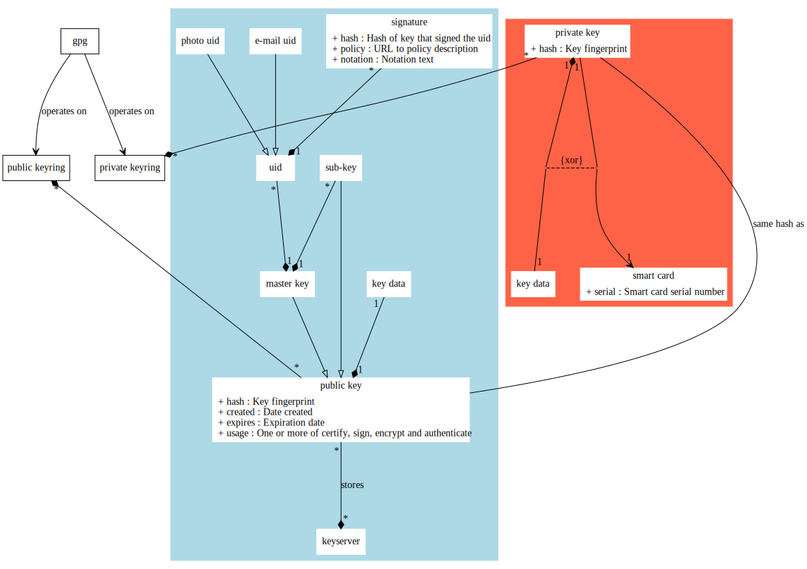

License:

This work is licensed under a Creative Commons Attribution 4.0 International License.

Problems:

- Using multiple Yubikeys for same GPG key
- Having multiple smart cards
- Outlook 2013 plugin instability

Successes:

- Key signing using scripts
- Decrypt using Android phone
- Decrypt using Claws mail
- Using Yubikey

Tips:

- Policy for signatures
- Turn off unsafe hash algoritms (SHA-1, ??)
- Signing key always use master key.

Quick GPG into
==============

The following web site explains what GPG is:
 -  https://en.wikipedia.org/wiki/GNU_Privacy_Guard

This is the official GPG web site:
 -  https://www.gnupg.org

This is the standard for using GPG with mails:
 -  https://tools.ietf.org/html/rfc4880

The man-page is also a good source of information. I always use "gpg2",
since it has better support for smart cards.

Some things were not that obvious to me from the beginning, so I'll try to
cover them in this chapter. First a nice graph below how things relate to
each other:

GPG command and keyrings
------------------------

To understand this diagram, start with "gpg" since this is the tool you will
use for managing your keys. The "gpg" command needs at least one public
keyring and one private (secret) keyring. By default there is one each in
~/.gnupg directory, created by "gpg" if it does not exist already. Using
command line option "--keyring" to add a public keyring file,
"--secret-keyring" to add a private keyring file and "--no-default-keyring"
to not use the default public and private keyring files. Note that keyring
file names are relative to ~/.gnupg directory, unless an absolute path is
given.

Keyring server
--------------

Normally you upload your master public key to a keyring server that belongs
to a pool of SKS keyring servers, e.g. by using
"--keyserver pool.sks-keyservers.net" to indicate what server to use. Keys
uploaded to one such key server will eventually be replicated to all the
others.

Note that by uploading the master public key, the public sub-keys will go
with it, which should normally be what you want.

GPG key, private and public
---------------------------

GPG keys come in pair, one private key and one public key. Each such pair
shares the same hash (fingerprint) and thereby also key ID. When talking
about a GPG key, this might sometimes refer to the public key and sometimes
to the key pair, which can be somewhat confusing.

The public key will decrypt what a private key has encrypted, and vice versa.
This means that if you send something, you encrypt using your private key and
the receiver decrypts using your public key. If someone sends something to you
they use your public key to encrypt, and you use your private key to decrypt.

Same applies to signatures, but signing instead of encrypting and verifying
signature instead of decrypting.

Master key vs. sub-key
----------------------

GPG keys have a two level hierarchy where a master key can have any number of
sub-keys. Master and sub-keys can all sign, encrypt and authenticate, but only
master key can certify.

User IDs, i.e. information about the key owner, belongs only to the master key.

User ID
-------

Master key has any number of user IDs, which can be e-mail address or photos.
The e-mail address has the following familiar syntax:

    name (description) <e-mail>

E.g.:

    Anders Andersson (private) <anders.andersson@gmail.com>

The "()" part is optional, but the rest is usually expected to be present.
However, this is free text so this is merely a recommended syntax.

